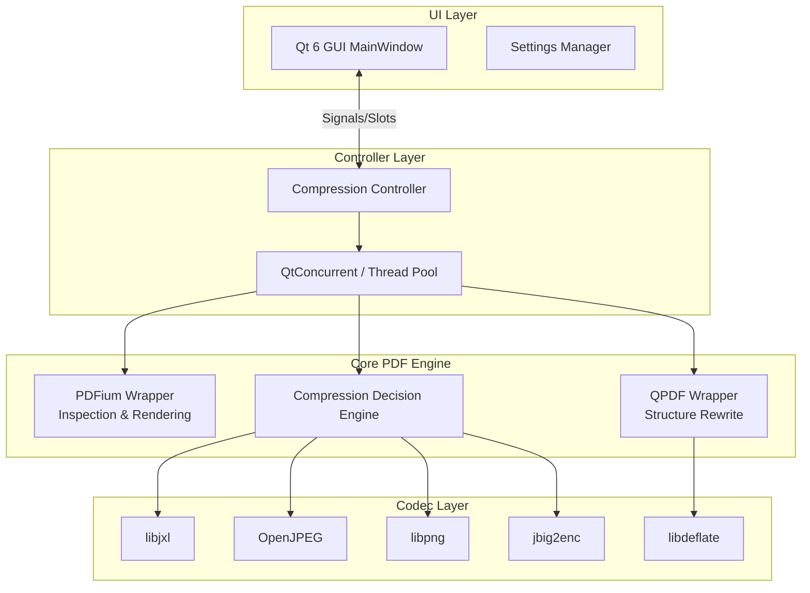
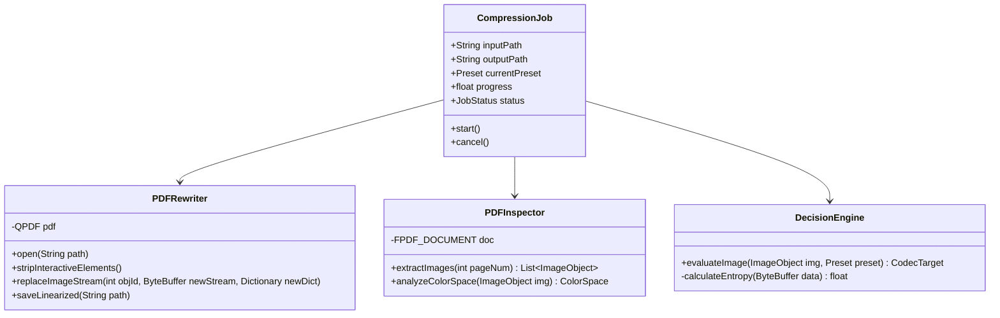
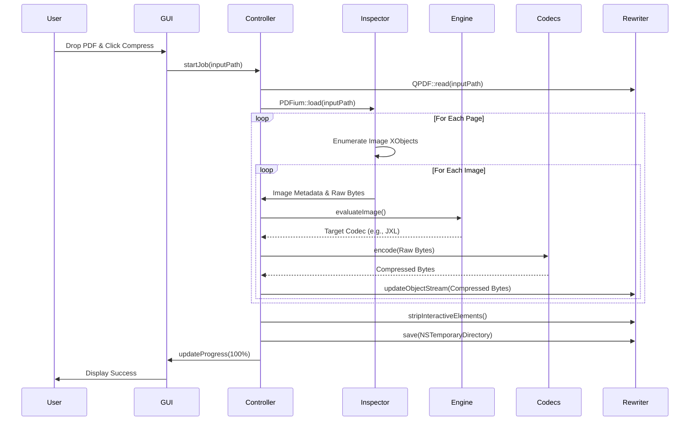

# Software Architecture Specification: macOS PDF Compressor

> **Document Version:** 1.0
> **Target OS:** macOS 13.0+ (Ventura and later)
> **Architecture:** Universal Binary (Apple Silicon + Intel)

---

## 1. Executive Summary

This Software Architecture Specification (SAS) details the design and implementation strategy for a native macOS desktop application designed to perform high-quality, local PDF compression. The application operates entirely offline, preserving privacy while applying intelligent compression algorithms (JPEG XL, JPEG 2000, JBIG2) to embedded images, and optimizing PDF structure using QPDF.

---

## 2. High-Level Architecture

The system is built on a C++20 core with a Qt 6 frontend. It follows a strict Model-View-Controller (MVC) architecture, separating the Qt-based GUI from the underlying C++ compression logic.



---

## 3. Module Responsibilities

### 3.1 GUI Module (`src/gui/`)
* **MainWindow:** Handles drag-and-drop events, presents the compression queue, and displays progress.
* **PresetManager:** Manages user-selected compression profiles (Lossless, Balanced, Max Compression).
* **BeforeAfterViewer:** Uses PDFium to render a split-screen view of the original vs. compressed PDF for visual QA.

### 3.2 Core Module (`src/core/`)
* **CompressionController:** The orchestrator. Receives jobs from the GUI, dispatches them to the Thread Pool, and aggregates results.
* **PDFInspector:** Wraps PDFium. Responsible for enumerating pages, extracting image objects, and reading metadata (DPI, color space).
* **PDFRewriter:** Wraps QPDF. Responsible for stripping metadata, removing interactive elements (annotations, bookmarks), updating object streams, and linearizing the final output.
* **DecisionEngine:** The heuristic core. Analyzes extracted images and decides the optimal codec and quality settings.

### 3.3 Codec Module (`src/codecs/`)
* Contains thin C++ wrapper classes around C-based libraries (libjxl, OpenJPEG, etc.) to ensure RAII compliance and memory safety.

---

## 4. Class Diagrams



---

## 5. PDF Object Model & Data Flow

The data flow ensures that original files are never mutated directly. All work is performed in RAM or in the macOS designated temporary directory.



---

## 6. Compression Decision Engine Algorithms

The Decision Engine uses lightweight heuristics to classify images without requiring heavy dependencies like OpenCV.

### 6.1 Heuristic Pseudo-code

```python
function evaluateImage(image_metadata, raw_pixels, preset):
    if preset == "Lossless":
        return CodecTarget(PNG, quality=100)
        
    if image_metadata.has_alpha_channel:
        # Preserve transparency efficiently
        return CodecTarget(PNG, optipng_level=3)
        
    unique_colors = count_unique_colors_sampled(raw_pixels, stride=10)
    
    if unique_colors < 2:
        # Pure monochrome (scanned text)
        return CodecTarget(JBIG2, lossless=False)
        
    if unique_colors < 256 and calculate_entropy(raw_pixels) < LOW_ENTROPY_THRESHOLD:
        # Likely vector art rendered to raster, or UI screenshot
        return CodecTarget(PNG, indexed=True)
        
    # High color depth, high entropy -> Photographic content
    if target_os_supports_jxl():
        quality_map = {"High": 90, "Balanced": 60, "Max": 30}
        return CodecTarget(JXL, quality=quality_map[preset])
    else:
        return CodecTarget(JPEG2000, quality=quality_map[preset])
```

---

## 7. Threading Architecture

Since this is a macOS application, we must leverage the hardware efficiently (especially Apple Silicon Performance/Efficiency cores).

* **Main Thread (UI):** Qt event loop. Never blocked.
* **Worker Threads:** We utilize `QThreadPool` and `QtConcurrent::mapped` to process PDF pages in parallel.
* **Concurrency Model:** 
  1. `PDFRewriter` creates a synchronized queue of Image IDs to process.
  2. A pool of worker threads grabs an Image ID, extracts it via `PDFInspector`, compresses it, and places the compressed buffer into a synchronized output map.
  3. Once all images are processed, the main controller thread instructs `QPDF` to swap the object streams sequentially (to avoid QPDF internal data races).

---

## 8. Memory Management Strategy

PDF compression is notoriously memory-intensive. To prevent OOM (Out of Memory) crashes on large textbooks:
1. **Streaming Codecs:** Libjxl and libpng will be configured to use streaming APIs (row-by-row) rather than loading uncompressed 4K images entirely into RAM.
2. **Aggressive RAII:** All C-library pointers (`FPDF_DOCUMENT`, `jxl_enc`) are wrapped in `std::unique_ptr` with custom deleters.
3. **Paging to Disk:** For PDFs larger than 2GB, the application will offload decoded intermediate buffers to `NSTemporaryDirectory()` instead of holding them in RAM.

---

## 9. Qt UI Wireframes

The UI follows macOS Human Interface Guidelines, utilizing translucent sidebars and standard Apple typography (SF Pro). 


* **Left Sidebar:** Navigation for Home, Batch Processing, and Settings.
* **Center Drop Zone:** Massive hit area for dropping single or multiple PDFs.
* **Presets:** Distinct, selectable cards to quickly choose compression ratios.
* **Status Bar:** Real-time progress updates.

---

## 10. Dependency Management (vcpkg & Homebrew)

We use a hybrid dependency management approach. `vcpkg` handles cross-platform C++ libraries to ensure consistent builds, while `Homebrew` provides macOS-specific build tools.

### 10.1 Environment Setup (Terminal Commands)

```bash
# 1. Install macOS build tools
brew install cmake ninja pkg-config qt@6

# 2. Clone vcpkg as a submodule in the project
git submodule add https://github.com/microsoft/vcpkg.git third_party/vcpkg
./third_party/vcpkg/bootstrap-vcpkg.sh

# 3. Create vcpkg.json in project root
cat << 'EOF' > vcpkg.json
{
  "name": "pdf-compressor",
  "version-string": "1.0.0",
  "dependencies": [
    "qpdf",
    "libpng",
    "libjpeg-turbo",
    "openjpeg",
    "libdeflate"
  ]
}
EOF
```
*(Note: PDFium is highly customized and usually requires a pre-compiled binary via a separate fetch script, or `pdfium-binaries` release download).*

---

## 11. Unit and Integration Testing Strategy

Testing framework: **Catch2**

* **Unit Tests (`tests/unit/`):**
  * Test `DecisionEngine` heuristics by feeding it known raw pixel buffers (a photo, a solid color, a scanned text page) and verifying it selects the correct CodecTarget.
  * Test codec wrappers for memory leaks using `leaks` CLI on macOS during the test run.
* **Integration Tests (`tests/integration/`):**
  * End-to-end compression of a suite of 10 standard test PDFs (containing vectors, CMYK photos, passwords, forms).
  * Assertions check that:
    1. Output size < Input size.
    2. Output PDF is valid (can be opened by QPDF without warnings).
    3. Interactive elements are confirmed stripped.
* **Fuzzing:** Optional integration with `libFuzzer` to feed malformed PDFs into the `PDFInspector`.

---

## 12. Performance Benchmarking Plan

Before release, the application must be benchmarked against standard tools (e.g., Ghostscript, Adobe Acrobat).

### Benchmark Criteria
1. **Compression Ratio:** `(Original Size - Compressed Size) / Original Size * 100`
2. **Processing Time:** Total wall-clock time from job start to save complete.
3. **Peak Memory (RSS):** Tracked via macOS `/usr/bin/time -l`.
4. **Visual Quality (SSIM):** Use Structural Similarity Index Measure between original and compressed images to guarantee no perceivable quality loss on the "High Quality" preset.

### Hardware Targets
* Target A: M2 MacBook Air (8GB RAM) - Ensure no swapping occurs on 100MB PDF.
* Target B: M3 Max MacBook Pro (64GB RAM) - Ensure maximum core utilization during parallel page processing.
